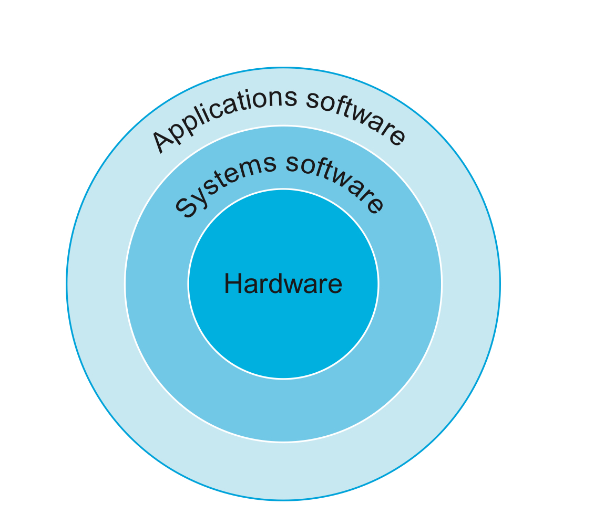
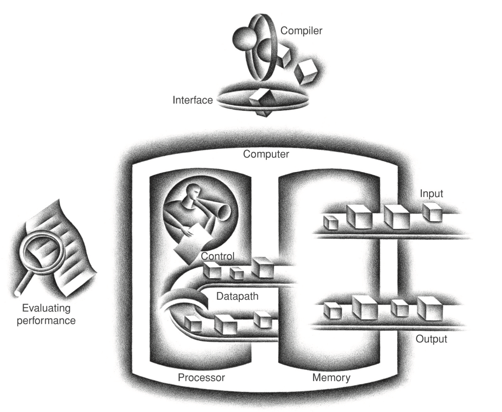

# 컴퓨터 구조 정리

컴퓨터 구조 과목을 수강하면서 공부한 내용을 정리해보려고 합니다.

### Moore's Law

- 18개월~24개월 마다 integrated circuit이 사용할 수 있는 자원이 2배로 늘어나는 법칙

  integrated circuit

  - chip이라고도 불린다
  - 수백만개의 transistors의 모음

### 컴퓨터를 수직적 Layer로 분석하면 다음과 같이 분석할 수 있다.

#### systems software는 시스템에서 자주 사용하는 기능을 제공하는 software

- operating system

- compiler

  - 보통 high-level language를 assembly language로 바꾸는 프로그램을 뜻한다.

    - assembly language는 assembler를 통해 binary machine language로 바꾼다.
    - machine language와 1:1 mapping 관계를 가진다.

  - 바로 binary machine language로 변환하는 경우도 있다.

### 컴퓨터의 5개의 구성요소

- hardware technology와 별개로 컴퓨터는 five classic components를 가진다

  1. input
  2. output
  3. memory
     - 실행되는 프로그램과 그 프로그램에 필요한 데이터가 저장되는 공간
     - DRAM
       - dynamic random access memory
       - 어느 부분의 메모리를 읽든 동일한 시간이 걸린다.
       - < - > RAM
         - magnatic tapes
         - sequential access
  4. datapath
     - 수학적 연산을 처리
  5. control
     - 프로그램의 지시에 따라 datapath, memory, I/O device에게 명령을 내림

  - 4,5번을 합쳐 processor라고 부른다

    - CPU(central processor unit)이라고도 불린다.

    - processor 안에는 **cache memory**가 있다.

    - cache memory

      - DRAM memory를 위한 버퍼 역할
      - DRAM보다 빠르다 작고 밀집도가 높아 비싸다.
      - SRAM(static random access memory)

